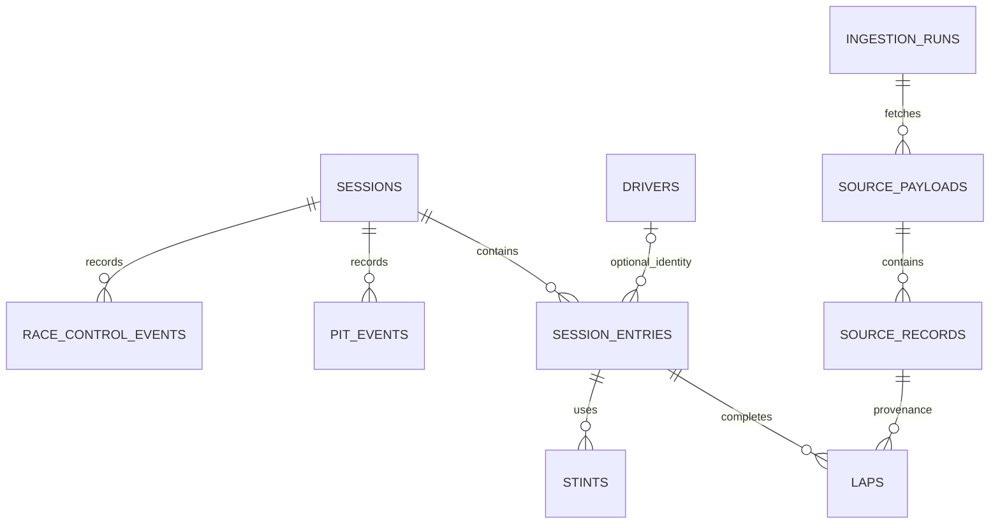

# Stage 3 — schema and database setup

## Purpose and main concept

The source is a collection of JSON observations. The schema gives each kind of observation a named table and a rule for identifying one row. Primary keys identify rows; foreign keys prevent references to missing parents; joins combine related rows; indexes help Postgres locate relevant rows. This stage stores source facts and validates a tiny fixture. It does not load historical races or calculate race analytics.

Read [data dictionary](data-dictionary.md) for every implemented table's grain, keys, fields and constraints. `session_entries` is the bridge from a race session to a numbered driver entry. Driver numbers and names alone never assign a cross-season person identity. `drivers` uses internal UUIDs, defaults to unresolved identity, and may be unlinked from an entry.



Every typed table has a source-record FK; the diagram shows one representative link. Pit/control driver references are optional and session-scoped. They do not require a lap row, because source coverage can be partial.

## Current verified setup

Development and production now use distinct Neon direct endpoints from the user-created projects. All three migrations applied to both; restricted SQL-created app/ingestion logins connect successfully, with credentials saved only in their respective gitignored env files. Development fixture and permission checks passed and rolled back. Production was audited read-only; no fixture was inserted. Both have zero session rows. Repeated migration/provisioning runs retain the schema and credentials.

Console verified October 6, 2026 after user sign-in: **Free Plan ($0/month)**; two independent projects **f1-analytics-platform-dev** and **f1-analytics-platform-prod**, both AWS US East 2 (Ohio), Postgres 18, one default branch named `production`, one primary compute each. The default branch name in the development project does not make it the production environment: the independent project/endpoint and local environment marker determine the target. Both endpoint IDs match their respective owner URLs. Compute range is 0.25–2 CU and scale-to-zero is five minutes; settings were inspected and left unchanged. Each project showed 31.69 MB storage at inspection. No paid option was selected.

The previous isolated local Postgres 18 container `f1-analytics-stage3-dev` on `127.0.0.1:15432` and its named volume remain available; the env files now target Neon. No Docker container or volume was removed.

Start/stop the existing local container:

```powershell
docker start f1-analytics-stage3-dev
docker stop f1-analytics-stage3-dev
```

Stopping preserves the named volume. No command here deletes it. The application itself does not connect to a database yet.

## Neon Free setup — user account step

Official Free quotas checked October 5, 2026: 100 projects; 10 branches per project; 100 CU-hours/project/month; 1 GB Postgres/project with a 20 GB account-wide cap; 5 GB public transfer/project/month; scale-to-zero after five minutes; maximum 2 CU. Exhausted Free quotas suspend or reject work rather than billing overages. Two separate projects fit the published allowances if your account has room. This stage's tiny schema/fixture is small, but future retained raw responses count toward storage. Use modest compute and leave scale-to-zero enabled.

Source: [Neon's official Free quota document](https://github.com/neondatabase/website/blob/main/content/faqs/free-plan-limits-and-quotas.md), updated October 1, 2026. Older indexed pages show a smaller storage allowance; follow the lower value if your account's console differs. Never accept a paid upgrade, credit-card prompt or paid add-on. No paid option has been selected.

1. Sign in or create your account at [Neon Console](https://console.neon.tech/). Complete account terms/sign-in yourself. Do not send passwords or connection strings in chat.
2. Confirm your organization/account plan displays **Free**. Create project **f1-analytics-platform-dev** with default Postgres (17 or 18 works with this SQL), AWS US East if offered, and a small compute setting/scale-to-zero. Avoid sample apps, paid add-ons and production data imports. Note the project name and database name.
3. Create a second independent project, **f1-analytics-platform-prod**, with the same Free settings. Independent projects isolate credentials and data more strongly than branches sharing one project. If your account lacks a free project slot, leave production pending; do not upgrade or replace existing work automatically.
4. In the development project's **Connect** dialog, choose the project-owner role and correct database. Turn **connection pooling off** to obtain its direct PostgreSQL URL. Copy it only into your local development environment file as MIGRATION_DATABASE_URL. The owner is for migration/provisioning, never the app. No need to create application roles through Console: Console-created Neon roles inherit broad neon_superuser access; our SQL provisioning creates restricted roles instead.
5. Repeat for production's direct owner URL in its separate production file. Production provisioning/schema commands are explicit; fixtures and verification refuse production.

[Neon role documentation](https://github.com/neondatabase/website/blob/main/content/docs/manage/roles.md) explains the SQL-versus-Console privilege distinction. The CLI enforces certificate validation for remote hosts (`sslmode=verify-full`), uses a direct endpoint and never disables certificate checks for Neon. If TLS fails, resolve the certificate/network issue; do not switch to insecure SSL.

## Add credentials locally

Existing generated local files must be preserved. Before changing development to Neon, make a local backup:

```powershell
Copy-Item .env.development.local .env.local-postgres.local
```

This backup is gitignored. Open `.env.development.local` in your editor and set:

```dotenv
DATABASE_ENV=development
MIGRATION_DATABASE_URL=<development direct owner PostgreSQL URL, entered locally>
INGESTION_DATABASE_URL=
APP_DATABASE_URL=
```

Open `.env.production.local` and set DATABASE_ENV=production and the production owner URL; initially leave the restricted URLs blank. On a fresh checkout, copy `.env.example` to those two names first. Do not print these files, commit them, use NEXT_PUBLIC_ variables, or paste their contents into chat. Each file must point to its named project; the marker detects file-selection mistakes but cannot prove which remote project a copied URL belongs to. Windows directory permissions govern these files; never share the workspace's secret files.

## Exact commands and expected output

With either the verified local development URL or your Neon development URL configured:

```powershell
npm ci
npm run db:migrate
npm run db:roles
npm run db:fixture
npm run db:verify
npm run check
```

- First migration run: Applied 001_source_schema.sql, 002_access_roles.sql, 003_source_key_guards.sql; Migrations complete: development. Reruns report Already applied. Applied-file SHA-256 mismatches fail rather than editing history; SQL files use LF line endings via .gitattributes.
- Roles: Created restricted role f1_app_login / f1_ingest_login; saved only in .env.development.local. Passwords are random and never printed. Reruns retain the existing roles/passwords; a missing local URL produces a recovery error rather than resetting a password.
- Fixture: three joined rows—Fixture A laps 1/2 with exact duration 90.125 / NULL and Fixture B lap 1 with 91.5 and no stint. **All values are synthetic, not F1 measurements.** The transaction rolls back. No fake race rows remain; identity sequences can advance even after rollback.
- Verify: PASS for joins/timezones/nulls/keys/FKs, event multiplicity/replay, provenance, rollback and both real restricted logins. All verification fixtures roll back. Requires migrations and db:roles first.
- Check: lint, TypeScript and 14 unit/smoke tests, then a static build of the two app routes. Database verification is separate locally; CI also runs it using disposable Postgres. The Stage 3 implementation passed [the fresh-database CI run](https://github.com/hsivasambu/f1-analytics-platform/actions/runs/37408128495).

Production setup, only after the separate Free project and local production owner URL exist:

```powershell
npm run db:migrate -- --env production
npm run db:roles -- --env production
```

These create only schema and logins. `db:fixture` and `db:verify -- --env production` reject production. No migration or fixture executes as a side effect of starting/building the app. Run `npm run dev` to keep using the shell independently of database availability.

## Walkthrough: keys, foreign keys, joins and indexes

Read `sql/migrations/001_source_schema.sql`, starting with sessions → session_entries → laps. The lap key has three parts because different drivers have the same lap number and different sessions reuse driver numbers. Its composite FK requires a matching session entry before a lap can be inserted. A pit visit can remain valid when the relevant lap was not sampled.

Run `db:fixture` and inspect `sql/examples/fixture_join.sql`. It joins session metadata and driver-entry names using the exact composite keys, then uses a LEFT JOIN to keep a lap even if no stint range is known. NULL values remain visible. The verifier deliberately tries joining driver_number alone: the three fixture laps incorrectly expand to six rows.

Inspect the indexes at the end of migration 001. The lap primary key supports one driver's lap sequence; `(session_key,lap_number,driver_number)` supports looking up drivers on the same race lap. Session/date indexes support chronological event lookup. `EXPLAIN SELECT * FROM f1.laps WHERE session_key=900000001 AND lap_number=1;` shows a query plan; an empty/tiny table may legitimately use a sequential scan. No speed claim is made from this fixture.

## Two exercises

1. **Foreign key and grain.** Explain why a lap must reference `(session_key, driver_number)` rather than driver_number alone. Predict the error when an entry's driver_id points to a nonexistent UUID. Run `db:verify`, which demonstrates both errors without retaining bad rows.
2. **SQL: unknown versus numeric zero.** Inside the fixture transaction, write a query that counts laps and known durations separately, then computes AVG(lap_duration). Explain whether the unknown duration should be replaced by zero. This is a learning query, not a production metric. To try it, insert it temporarily after the fixture query in `scripts/db/fixture.ts`, or run the fixture SQL and query in a database client between BEGIN and ROLLBACK.

### Answers — read after trying

1. Numbers recur across sessions/seasons; the pair identifies an entry. A nonexistent driver_id violates the UUID FK (SQLSTATE 23503). A wrong source natural key is rejected by the provenance guard (23514); a duplicate lap key is 23505. A foreign key checks row existence, not whether a name denotes the same real person.
2. Query:

```sql
SELECT count(*) AS lap_rows,
       count(lap_duration) AS known_durations,
       avg(lap_duration) AS average_known_seconds
FROM f1.laps
WHERE session_key IN (900000001, 900000002);
```

The fixture has three rows and two known durations. AVG ignores NULL and returns 90.8125 seconds (computed and verified by SQL on the synthetic fixture). Zero would add a fictional observation and change the denominator. This combines two fictional sessions for the exercise only; a real pace comparison needs its own documented matching/exclusion rules later.

## Design tradeoff

Full-record hashes plus occurrence ranks conservatively distinguish event content and preserve duplicate occurrences. This avoids assuming that same-time messages are one event, but corrected records remain separate and need later reconciliation. The raw archive plus source key guards preserves an audit trail without prematurely implementing ingestion or analytics. See the dictionary's deduplication section for incomplete-response and collision limitations.

## Recheck the completed Neon setup

Run from the repository root:

```powershell
npm run db:audit
npm run db:audit -- --env production
npm run db:verify
npm run dev
```

Expected: both audits print three ledger versions, `sessions=0` before any later ingestion, and PASS lines for the three credential purposes. Development verification prints PASS lines and rolls fixtures back. Next serves the home page at http://localhost:3000; open `/methodology` next. The app still needs no database connection.

The audit opens read-only transactions in either environment, checks matching endpoint/database/role, actual TLS socket certificate authorization, migration ledger and restricted privileges. `pg_stat_ssl` on the Neon backend reported false during investigation, so it is not used to claim public-connection encryption. Production verification deliberately uses this read-only audit; destructive permission-denial checks and synthetic calculations ran only in development. The two learning exercises and separate answers above remain applicable to the rollback fixture.
